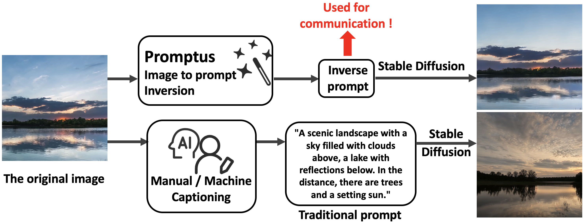

# Promptus: Representing Real-World Video as Prompts for Video Streaming

This is the official implementation of the paper [Promptus: Can Prompts Streaming Replace Video Streaming with Stable Diffusion](https://arxiv.org/abs/2405.20032), which represents real-world videos with a series of "prompts" for delivery and employs Stable Diffusion to generate pixel-aligned videos at the receiver.



<div style="text-align: center;">
  
  <p><strong>The original video &nbsp;&nbsp;vs &nbsp;&nbsp;The video generated from inverse prompts</strong></p>
</div>

## Inversion
### (0) Getting Started
Clone this repository, enter the `'Promptus'` folder and create local environment:
```bash
$ conda env create -f environment.yml
$ conda activate promptus
```
Alternatively, you can also configure the environment manually as follows:
```bash
$ conda create -n promptus
$ conda activate promptus
$ conda install python=3.10.14
$ conda install pytorch=2.5.1 torchvision pytorch-cuda=12.1 -c pytorch -c nvidia
$ pip install tensorrt==10.7.0
$ pip install tensorrt-cu12-bindings==10.7.0
$ pip install tensorrt-cu12-libs==10.7.0
$ pip install diffusers==0.26.1
$ pip install opencv-python==4.10.0.84
$ pip install polygraphy==0.49.9
$ conda install onnx=1.17.0
$ pip install onnx_graphsurgeon==0.5.2
$ pip install cuda-python==12.6.2.post1
# At this point, the environment is ready to run the real-time demo.
$ pip install torchmetrics==1.3.0.post0
$ pip install huggingface_hub==0.25.0
$ pip install streamlit==1.31.0
$ pip install einops==0.7.0
$ pip install invisible-watermark
$ pip install omegaconf==2.3.
$ pip install pytorch-lightning==2.0.1
$ pip install kornia==0.6.9
$ pip install open-clip-torch==2.24.0
$ pip install transformers==4.37.2
$ pip install openai-clip==1.0.1
$ pip install scipy==1.12.0
```
If you only want to experience real-time generation, please skip to the 'Real-time Demo' part.
### (1) Stable Diffusion Model
Download the official SD Turbo model `'sd_turbo.safetensors'` from [here](https://huggingface.co/stabilityai/sd-turbo/tree/main), and place it in the `'checkpoints'` folder.
### (2) Data preparation
As a demo, we provide two example videos (`'sky'` and `'uvg'`) in the `'data'` folder, which you can test directly. 

You can also use your own videos, as long as they are organized in the same format as the example above.
### (3) Training (Inversion)
```bash
$ python inversion.py -frame_path "data/sky" -max_id 140 -rank 8 -interval 10
```

Where `'-frame_path'` refers to the video folder, `'-max_id'` is the largest frame index. `'-rank'` and `'-interval'` together determines the target bitrate (Please refer to the paper for details).

As an example, the inverse prompts are saved in the `'data/sky/results/rank8_interval10'` folder.

### (4) Testing (Generation)

After training, you can generate videos from the inverse prompts. For example:
```bash
$ python generation.py -frame_path "data/sky" -rank 8 -interval 10
```
the generated frames are saved in the `'data/sky/results/rank8_interval10'` folder.

We provide pre-trained prompts (in 225 kbps) for `'sky'` and `'uvg'` examples, allowing you to generate directly without training.


## Real-time Demo
### (0) Getting real-time engines

We release the real-time generation engines. 

If your GPU is an Nvidia GeForce 4090D, the compatible engines can be downloaded directly. Please download the engines from [here](https://drive.google.com/drive/folders/1w-SWduvQ5ZZKLokae1rBXAKG10YGMQzF?usp=sharing), and place the `'denoise_batch_10.engine'` and `'decoder_batch_10.engine'` in the `'engine'` folder.

If you use a different GPU, Promptus will automatically build engines for your machine. Please download the `'denoise_batch_10.onnx'` and `'decoder_batch_10.onnx'` files from [here](https://drive.google.com/drive/folders/1w-SWduvQ5ZZKLokae1rBXAKG10YGMQzF?usp=sharing), and place them in the `'engine'` folder.
In this case, please wait a few minutes during the first run for the engines to be built.

### (1) Real-time generating
We provide pre-trained prompts (in 225 kbps) for `'sky'` and `'uvg'` examples, allowing you to generate directly without training.
For example:
```bash
$ python realtime_demo.py -prompt_dir "data/sky/results/rank8_interval10" -batch 10 -visualize True
```
the generated frames are saved in the `'data/sky/results/rank8_interval10'` folder.

You can also train your own videos as described above and use the generation engines for real-time generation.

On a single NVIDIA GeForce 4090D, the generation speed reaches 170 FPS. The following video shows an example:

<div style="text-align: center;">
  
  <strong><p>Real-time Demo</strong></p>
</div>

## Integrated into browsers and video streaming platforms

Promptus is integrated into a browser-side video streaming platform: [Puffer](https://github.com/StanfordSNR/puffer).

### Media Server
Within the media server, we replace `'video chunks'` with `'inverse prompts'`.
Inverse prompts have multiple bitrate levels and are requested by the browser client.

### Browser Player
At the client, the received prompts are forwarded to the Promptus process. Within the Promptus process, the real-time engine and a GPU are invoked to generate videos. The generated videos are played via the browser's Media Source Extensions (MSE).

The following videos show examples:

<div style="text-align: center;">
  
  <strong><p>Promptus in Browser-side Video Streaming</strong></p>
</div>

<div style="text-align: center;">
  
  <strong><p>Promptus under real-world network traces</strong></p>
</div>

&nbsp;

*To start, it is recommended to run the Real-time Demo with the pre-trained prompts, as it is the simplest way to experience Promptus.

*The inversion code will be open-sourced after publication. If needed, please email `jiangkai.wu@stu.pku.edu.cn` with the following information:

- Your name, title and affilation
- Your intended use of the code

I will promptly send you the inversion code.

## Acknowledgement
Promptus is built based on these repositories:

[pytorch-quantization-demo](https://github.com/Jermmy/pytorch-quantization-demo) 

[generative-models](https://github.com/Stability-AI/generative-models) 

[StreamDiffusion](https://github.com/cumulo-autumn/StreamDiffusion) 

[DiffDVR](https://github.com/shamanDevel/DiffDVR) 

[taesd](https://github.com/madebyollin/taesd) 

[puffer](https://github.com/StanfordSNR/puffer) 

## Citation
```
@article{wu2024promptus,
  title={Promptus: Can Prompts Streaming Replace Video Streaming with Stable Diffusion},
  author={Wu, Jiangkai and Liu, Liming and Tan, Yunpeng and Hao, Junlin and Zhang, Xinggong},
  journal={arXiv preprint arXiv:2405.20032},
  year={2024}
}
```
